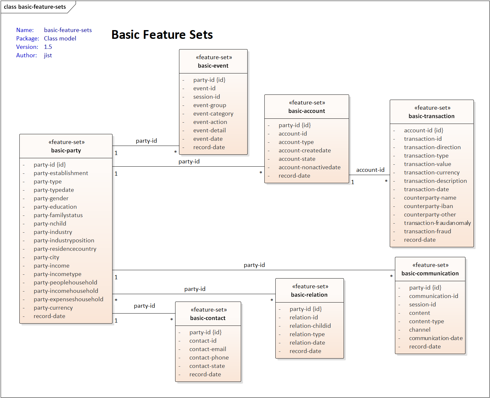
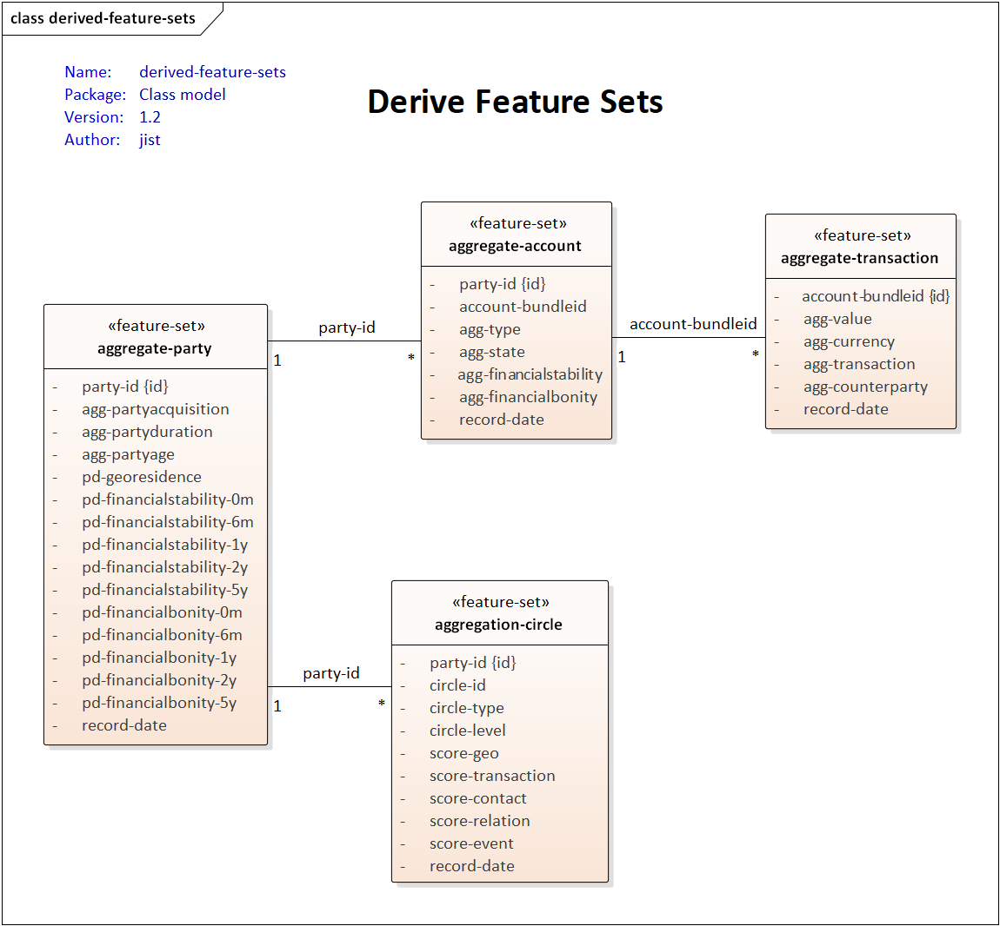

 

# QGate-Model
The machine learning meta-model with synthetic data (useful for MLOps/feature store), is independent of machine
learning solutions (definition in json, data in csv/parquet). It can be used with various of 
ML/MLOps solutions with or without FeatureStore.

## Usage
This meta-model is suitable for:
 - compare capabilities and functions of machine learning solutions (as part of RFP/X and SWOT analysis)
 - independent test new versions of machine learning solutions (with aim to keep quality in time)
 - unit, sanity, smoke, system, reqression, function, acceptance, performance, shadow, ... tests
 - external test coverage (in case, that internal test coverage is not available or weak)
 - etc.

Note: You can see real usage in e.g. project **[qgate-sln-mlrun](https://github.com/george0st/qgate-sln-mlrun)** for testing MLRun/Iguazio solution.

## Structure
The solution contains this simple structure:
 - **00-high-level**
   - The high-level [view](#model) to the meta-model for better understanding
 - **01-model**
   - The definition contains 01-projects, 02-feature sets, 03-feature vectors, etc. in JSON format
   - This model is designed for these [use cases](./docs/usecases.md) 
 - **02-data**
   - The data for meta-model in CSV/GZ format (future support parquet) for party, account, transaction, event, communication, etc.
   - You can also generate your own dataset with requested size (see cmd 'python main.py generate --help')

Addition detail, [see](./docs/structure.md)

## Model

